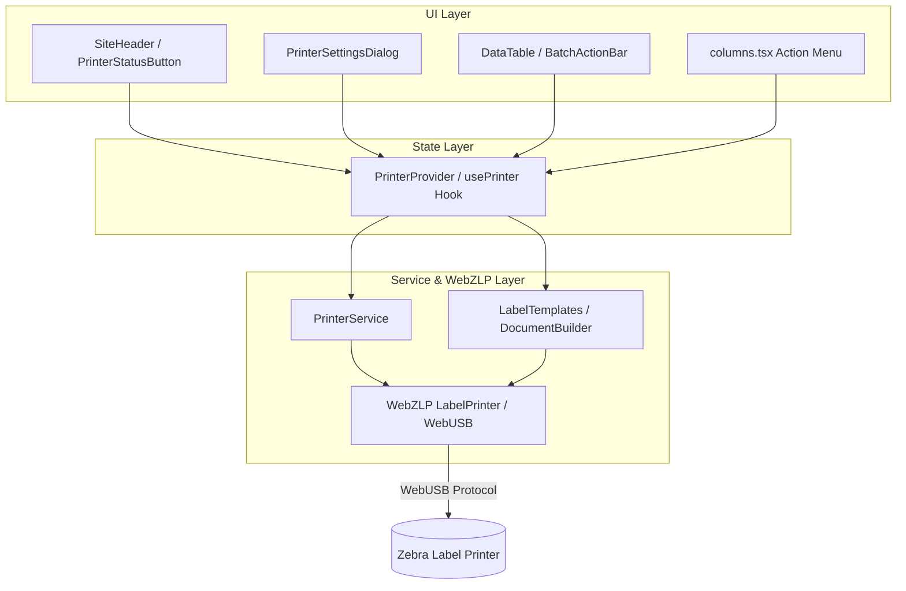

# Requirements

### Overview & Goals

Integrate the **WebZLP** (`webzlp`) package into the Mobile Phone Museum Handset application to enable direct,
in-browser thermal label printing via WebUSB to Zebra EPL/ZPL label printers (e.g., LP2844, LP2824, ZD-series). This
allows museum curators and staff to print barcode/QR labels for handset catalog inventory directly from the product
management table.

### Scope

- **In Scope**:
    - WebUSB browser capability checks and secure context handling.
    - Printer discovery, USB device pairing, auto-reconnect, and connection status management.
    - Label template builder formatting `Product` entity data (ID, Model display name, IMEI, description, and short URL
      QR/barcode `i.mpm.ax/pr/{id}`) using WebZLP's `LabelDocumentBuilder`.
    - Global `PrinterProvider` and `usePrinter` hook.
    - Header printer status widget and printer settings / diagnostics modal.
    - Single-item label printing from the `DataTable` row actions dropdown (`app/products/columns.tsx`).
    - Batch label printing for selected table rows in `components/data-table.tsx` / `app/products/page.tsx`.
    - Error handling with user feedback (toasts for USB permissions, disconnections, unsupported browsers).
- **Out of Scope**:
    - Server-side printing via Node.js (WebUSB is strictly browser-side).
    - Network (RAW/TCP/LPR) printer discovery (WebZLP focuses on WebUSB channels).

### User Stories

- **As a museum registrar**, I want to connect my Zebra USB label printer directly in the web app so that I can print
  physical inventory tags without installing external print driver software.
- **As a curator**, I want to click "Print Label" on any product in the inventory table to instantly print an asset tag
  with the device details and QR code.
- **As a cataloguer**, I want to select multiple products in the data table and print labels in a single batch to
  streamline bulk cataloging workflows.

# Technical Design

### Current Implementation

- `package.json` already contains `"webzlp": "^2.0.4"`.
- `app/products/page.tsx` fetches products via Apollo GraphQL and renders them using `DataTable`
  (`components/data-table.tsx`) and column definitions (`app/products/columns.tsx`).
- `components/data-table-features.ts` enables row selection (`rowSelectionFeature`), pagination, filtering, and sorting
  via `@tanstack/react-table` v9.
- `app/layout.tsx` mounts global providers (`AuthProvider`, `ApolloWrapper`, `TooltipProvider`, `SidebarProvider`,
  `Toaster`).

### Key Decisions

1. **Client-Side Safe Architecture**:
    - WebUSB (`navigator.usb`) is only available in browser environments under HTTPS / localhost.
    - All WebZLP interactions will be isolated behind client components (`"use client"`) and guarded by environment
      checks (`typeof window !== 'undefined' && 'usb' in navigator`).
2. **Centralized React Context (`PrinterProvider`)**:
    - Maintain a single active `LabelPrinter` instance across the app lifecycle.
    - Listen to WebUSB `connect` and `disconnect` events to maintain live connection status.
    - Automatically re-attach to previously authorized USB devices upon page load using `navigator.usb.getDevices()`.
3. **Template Engine Separation (`lib/printer/label-templates.ts`)**:
    - Decouple label layout and graphics generation from UI components.
    - Support standard label sizes (e.g. 2.25" x 1.25", 2" x 1", 4" x 6") and render QR codes for `i.mpm.ax/pr/{id}` and
      Code 128 for IMEIs.
4. **Table Integration (`DataTable` & `columns.tsx`)**:
    - Row-level action: Add "Print Label" to `DropdownMenu` in `columns.tsx`.
    - Batch-level action: Leverage TanStack Table's `getFilteredSelectedRowModel()` to provide a batch print action bar.

### Architecture Diagram



### Proposed File Structure

```
mpm-handset/
├── lib/
│   └── printer/
│       ├── printer-service.ts     # WebUSB & WebZLP LabelPrinter lifecycle
│       ├── label-templates.ts     # Label layout builder for Product records
│       └── types.ts               # Printer and label configuration types
├── hooks/
│   └── use-printer.ts             # Consumer hook for printer state & actions
├── components/
│   ├── printer/
│   │   ├── printer-provider.tsx       # React Context provider
│   │   ├── printer-status-button.tsx  # Header connection status badge/button
│   │   ├── printer-settings-dialog.tsx# Device discovery & test print modal
│   │   └── label-preview-dialog.tsx   # Label preview & options dialog
│   ├── data-table.tsx                 # Enhanced with batch actions slot
│   └── site-header.tsx                # Includes PrinterStatusButton
└── app/
    ├── layout.tsx                     # Wrapped with PrinterProvider
    └── products/
        ├── columns.tsx                # Single print action menu item
        └── page.tsx                   # Bulk print integration
```

### Key Interfaces & Contracts

```typescript
export interface PrintOptions {
    copies?: number;
    labelSize?: 'small_2x1' | 'medium_2x1.25' | 'large_4x6';
    darkness?: number; // 0 - 30
}

export interface PrinterContextValue {
    isSupported: boolean;
    isConnected: boolean;
    isPrinting: boolean;
    printer: LabelPrinterUsb | null;
    device: USBDevice | null;
    connect: () => Promise<void>;
    disconnect: () => Promise<void>;
    printProductLabel: (product: Product, options?: PrintOptions) => Promise<boolean>;
    printBatchLabels: (products: Product[], options?: PrintOptions) => Promise<{ success: number; failed: number }>;
}
```

# Testing

### Validation Approach

- **Browser Compatibility & Capability Detection**:
    - Verify that browsers lacking WebUSB (e.g. Safari, Firefox) show an informative "WebUSB not supported" tooltip and
      disable USB connect triggers gracefully without crashing.
    - Verify that Chromium-based browsers (Chrome, Edge) successfully invoke `navigator.usb.requestDevice`.
- **Connection & Auto-Reconnect Lifecycle**:
    - Test initial USB pairing via `requestDevice`.
    - Verify `navigator.usb.getDevices()` automatically reconnects upon page refresh without additional user prompts.
    - Verify USB disconnect events update the status badge to "Disconnected" in real-time.
- **Label Generation & Printing Scenarios**:
    - Verify single label printing from the row actions dropdown generates the expected label format with product ID,
      IMEI, model name, and QR slug.
    - Verify multi-row selection in the data table prints all selected products sequentially with proper status updates
      and error handling.
    - Verify test feed and configuration printing via `ReadyToPrintDocuments`.

# Delivery Steps

### Step 1: Core WebZLP service, label templates, and React context provider

Establish the client-side printer abstraction, template generator, and React context provider.

- Create `lib/printer/printer-service.ts` encapsulating WebUSB device pairing (`navigator.usb.requestDevice`), reconnect
  detection (`navigator.usb.getDevices`), and `LabelPrinter` lifecycle management from `webzlp`.
- Create `lib/printer/label-templates.ts` to convert MPM Handset `Product` records (ID, IMEI, Model name, and QR/barcode
  URLs like `i.mpm.ax/pr/{id}`) into `LabelDocumentBuilder` printable instructions with configurable label dimensions
  and density.
- Create `components/printer/printer-provider.tsx` and `hooks/use-printer.ts` exposing global connection state, device
  metadata, print methods (`printProductLabel`, `printBatchLabels`), browser capability detection (`isSupported`), and
  active status.
- Wrap the app layout in `app/layout.tsx` with `PrinterProvider` (client-side safe).

### Step 2: Printer status indicator and settings dialog

Provide global printer controls and diagnostics dialog for device connection and configuration.

- Implement `components/printer/printer-status-button.tsx` showing current WebUSB printer connection status (Connected /
  Disconnected / Unsupported).
- Embed the printer status button into `components/site-header.tsx`.
- Create `components/printer/printer-settings-dialog.tsx` featuring printer discovery, connection trigger, printer
  diagnostic info (manufacturer, model, serial, status), test label feed (`ReadyToPrintDocuments.feedLabelDocument`),
  and print darkness adjustment.
- Integrate Sonner toast notifications for USB connection status and permission prompts.

### Step 3: Data table single and batch label printing integration

Enable individual and bulk label printing directly from the products data table.

- Add a "Print Label" action item to the row dropdown menu in `app/products/columns.tsx` invoking
  `printProductLabel(product)`.
- Create `components/printer/label-preview-dialog.tsx` allowing visual inspection of label layout, label size selection,
  and copy count prior to printing.
- Extend `components/data-table.tsx` and `app/products/page.tsx` with a bulk actions toolbar when table rows are
  selected, enabling batch label generation (`printBatchLabels(selectedProducts)`).
- Implement print queue handling and error boundaries to gracefully handle USB communication timeouts and disconnected
  hardware.